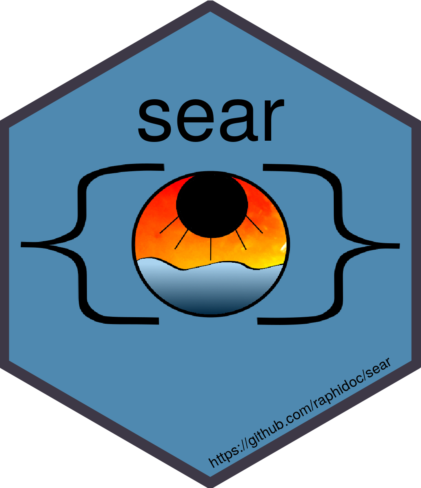

# sear 

  <!-- badges: start -->
  
  <!-- badges: end -->
  <!-- badges: start -->
  
  <!-- badges: end -->

Web-based reactive program for ocean optic data management and processing.

## Overview

The sear software is written in [shiny](https://github.com/rstudio/shiny) and was primarily designed to manage and process data for the [FORSCE SeaDoo project](https://ldgizc.uqar.ca/Web/infrastructures-et-equipements/forsce#forsce-english).
It allow to load, parse, display, process and save the data in an SQLite database.

Along it's development the idea come that it could be more, something like a platform to manage and process ocean optic data coming from any numbers of instruments and platform. This could be achieve by defining the architecture common to all ocean optic projects, the specifics of each instrument and platform and the method to be applied upon them. It would improve the efficiency of the analysts and give a solution to common problems faced with data management, processing and quality control.

To see a demonstration video of the software, click on the following picture:

## Features

### Settings

* Choose spectral resolution for HOCR output.
* Enter custom values for HOCR positions in water, distance from the surface and distance between the instruments.
* Settings are automatically saved to the application SQLite backend (different from the database backend)

{::comment}
*TODO* user input instruments position with serial number (sn) and instrument type (`"SAT(HPE|PED|HSE|HED|HPL|PLD|HSL|HLD)"`)
*TODO* Should we use a single database for both application settings and project data ?
{:/comment}

### Load and parse

* Files `.txt` and `.bin` from MTE data logger.
* Files `.txt` from HydroBall devices: NMEA log of GNSS (\$GPGGA), transducer (\$DBT), and gyrocompas (\$PTNTHPR).
* Files `.raw` from SatView.
* BioSonic csv exported by VisualAquatic.
* Calibration files for HOCR, SBE19. SBE18, SBE43, SeaOWL, BBFL2.
* Use longitude (`lon`), latitude (`lat`) and `date_time` from GNSS device (Applanix for the SeaDoo) to create a `MainLog`.
* Create a data synthesis, presence or absence of said instrument at a specific time in the `MainLog`.

{::comment}
*TODO* Save the calibration data from file format specific parser into the database with relation to the "environemental?" data that was created from it
{:/comment}

### Filters

* instruments combination based on the data synthesis
* date range
* time range
* Solar azimuth relative to the boat heading (to asses self shadow effect on AOPs)
* Watercraft speed

### Display

* Map created with plotly and Mapbox display raw data points and discrete observation with their spatial buffer
* Raw data point can be selected and processed to L1b to create a discrete observation
* Discrete observation can be clicked on to display the associated data
* When raw data is selected the associated solar azimuth relative to the boat is displayed in a polar plot

### Processing

* Click `Process L1b` to manually process selected raw data
* Click `Auto Process` to automatically process all displayed raw data, discretization is performed with a time interval of minimum 4 and maximum 10 seconds.
* Human qc of L1b data, analyst can click on the data to shift it between green (1 = good) and red (0 = bad). Data that have the flag qc flag 0 is removed from further analysis.
* Process L2 to summarize (mean) non spectral data. For the HOCRs, mean AOPs are computed.
* Additional Loess interpolation and smoothing for AOPs.
* Metadata include rotation of the vessel frame (X, Y, Z vectors in cartesian coordinates) if Tait-Bryan angles (heading, pitch, roll) are available.

### Save

* In manual processing,`Save` send the discrete observation L1b and L2 data to the SQL backend.
* In automatic processing data is automatically saved during each observation processing.
* If `Save` is hit for a uuid_l2 that is already present (reprocessing for example) the data corresponding to this uuid_l2 is updated.
* `Delete` to delete an observation from the database (with FOREIGN KEY ON DELETE CASCADE)

## Instalation

The software can be installed from GitHub.
To simplify the installation process, a python virtual env is created to use the python binary parser created with [Kaitai Struct](https://kaitai.io/)

## Code of Conduct

  Please note that the sear project is released with a [Contributor Code of Conduct](https://contributor-covenant.org/version/2/1/CODE_OF_CONDUCT.html). By contributing to this project, you agree to abide by its terms.

## Contributors

Raphaël Mabit: Author and maintainer

Daniela Walch: Help with logo design, point to relevant resources (wallace 2)

Bruno Dionne: Help with binary parsing
