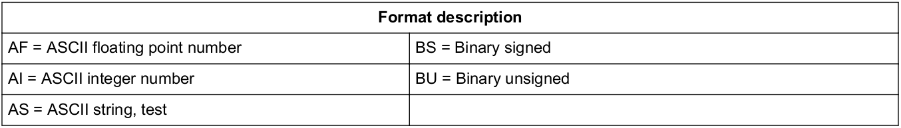
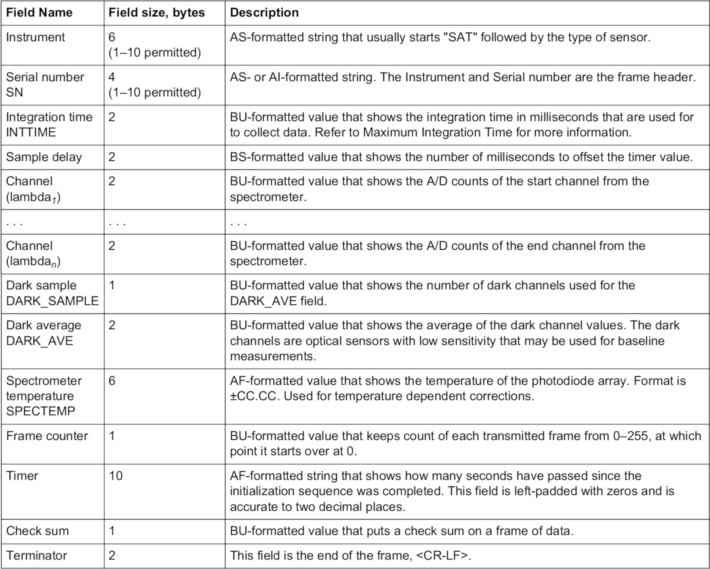
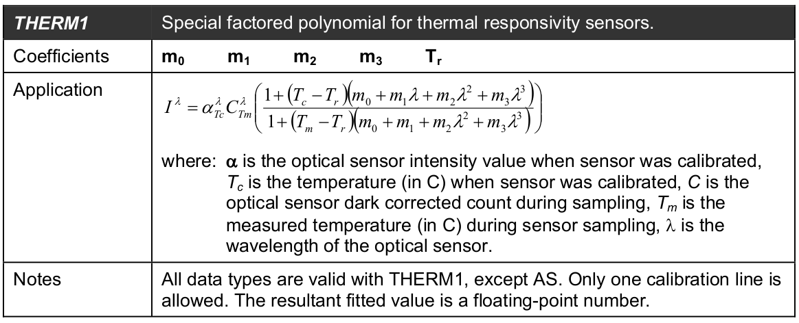
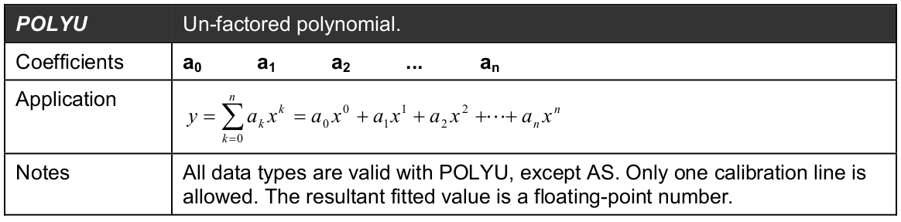
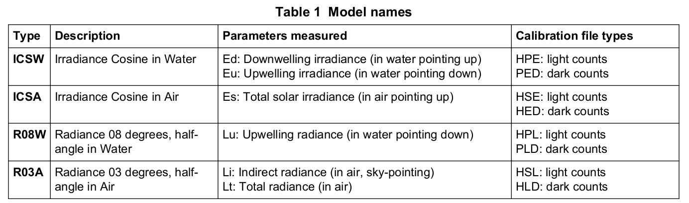
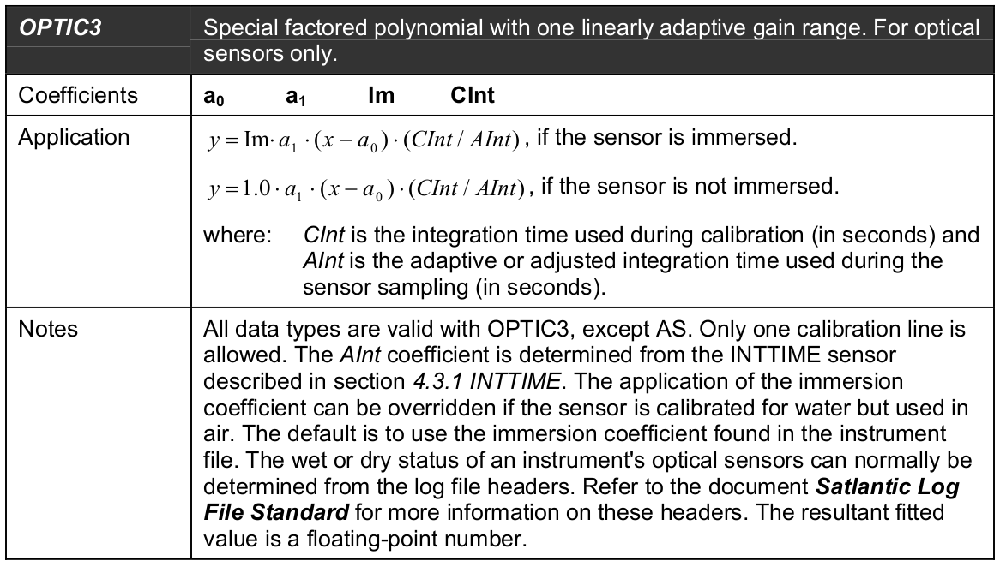

```{r, include = FALSE}
knitr::opts_chunk$set(
  collapse = TRUE,
  comment = "#>"
)
```

```{r setup}
golem::document_and_reload()

library(sear)
library(dplyr)
library(lubridate)
library(clock)
library(microbenchmark)
library(purrr)
library(plotly)
library(readr)
library(reticulate)
library(stringr)
library(tidyr)

reticulate::source_python(system.file("py","hocr.py", package = "sear", mustWork = T))
```

No

# Satlantic HOCR

HOCR data is stored in .raw file in a mix of ASCII and binary format.





# Read raw file

For that will pass by the kaitai struct parser trough python (or cpp as it may improve speed, have to test).
To code live in python use `reticulate::repl_python()`, to get object from python or r envs use `py$<name>` or `r.<name>`, `source_python()` to source function in python file.

```{r}
# Good data file: DATA_20211111_171729.bin

ConFile <- system.file("extdata", "DATA_20211111_171729.bin", package = "sear", mustWork = T)

# Python function
RawHOCR <- Hocr$from_file(ConFile)

RawHOCR <- RawHOCR$packets

# Filter invalid HOCR packets
# For now the only check is made on instrument name, could be more thorough

ValidInd <- purrr::imap_lgl(RawHOCR, ~ str_detect(as.character(.x$instrument, errors="ignore"), "SAT(HPL|HSE|HED|PLD)"))

if (any(!ValidInd)){
  warning(length(which(!ValidInd)), " invalids HOCR packets removed.")
  
  RawHOCR <- RawHOCR[ValidInd]
} else {
  RawHOCR <- RawHOCR
}
```

Some file appear to be corrupted: DATA_20211111_160607.bin, DATA_20211111_171729.bin
First noticed appeared with python `UnicodeDecodeError: 'utf-8' codec can't decode byte 0xb2 in position 3: invalid start byte`, when trying to decode ASCII string `Instrument, SN, Timer, SpecTemp`. The problem doesnt come from ASCII/UTF-8 difference (even so I should use ASCII to decode HOCR packet, Datalogger packet is of unkown encoding).

This look like some bytes are just missing in the DataLogger memory, just like for the GPGGA NMEA string inside the .txt file ...
So the DataLogger is likely the source of the problem ... Not the HOCR(s) nor the Applanix.

If this is confirmed might be a major problem for operational deployment. Also little data appear to be contaminated by this bug.

### Time filtering

The HOCR data is quite large and mainly compose of bad data, acuiered in transit, that we don´t want to loose time to process. Therfore, only the selected point designing a transect or a station will enter the processing chain. For that we use a time filter on the `RawHOCR` list of HOCR packets.

Ideally for this time filter, we should use the datalogger binary packet added before every HOCR packets, for now we only have determine the time format (in ms), the date format remain unknown. The quick fix is to use date from the Applanix.

Creating the time index for filtering take some time, so it is created on data uploading. The filtering is made as early as possible on the list object of HOCR packet.
This time index list still take time to create, ~ 3 min for 44826 packets (22.2 MB) and result in a list of 25.8 MB. It could be a great improvement to optimize this step.

```{r}
# end at 49:25

# ymd_hms("2021-11-11 18:49:16"), ymd_hms("2021-11-11 18:50:25")

Station1PaP <- interval(ymd_hms("2021-11-11 18:49:16"), ymd_hms("2021-11-11 18:50:25"))

AplaDate <- "2021-11-11"
```

## Benchmark to optimize time filtering

```{r}
# # Small test data with invalid packet: DATA_20211111_160607.bin
# 
# BenchConFile <- system.file("extdata", "DATA_20211111_160607.bin", package = "sear", mustWork = T)
# 
# # Python function
# BenchRawHOCR <- Hocr$from_file(BenchConFile)
# 
# BenchRawHOCR <- unlist(BenchRawHOCR$packets, recursive = T)
# 
# # Filter invalid HOCR packets
# 
# BenchValidInd <- purrr::map_lgl(BenchRawHOCR, ~ str_detect(as.character(.x$instrument, errors="ignore"), "SAT(HPL|HSE|HED|PLD)"))
# 
# if (any(!BenchValidInd)){
#   warning("Invalid HOCR packets detected and removed: ", length(which(!BenchValidInd)))
#   
#   BenchRawHOCR <- BenchRawHOCR[BenchValidInd]
# } else {
#   BenchRawHOCR <- BenchRawHOCR
# }
# 
# 
# pur_lub <- function(RawHOCR, AplaDate){
#   purrr::map(.x = RawHOCR, ~ lubridate::ymd_hms(paste0(AplaDate,"T",hms::as_hms(.x$gpstime/1000))))
# }

pur_clock <- function(RawHOCR, AplaDate){
  purrr::map(.x = RawHOCR, ~ clock::date_time_parse(paste0(AplaDate," ",hms::as_hms(.x$gpstime/1000)), zone = "UTC"))
}
# 
# pur_base <- function(RawHOCR, AplaDate){
#   purrr::map(.x = RawHOCR, ~ base::strptime(paste0(AplaDate,"T",hms::as_hms(.x$gpstime/1000)), format = "%Y-%m-%dT%H:%M:%S", tz = "UTC"))
# }
# 
# pur_lub2 <- function(RawHOCR, AplaDate){
#   purrr::map(.x = RawHOCR, ~ lubridate::fast_strptime(paste0(AplaDate,"T",hms::as_hms(.x$gpstime/1000)), format = "%Y-%m-%dT%H:%M:%S", tz = "UTC"))
# }
# 
# microbenchmark(times = 10,
#   pur_lub(BenchRawHOCR, AplaDate),
#   pur_clock(BenchRawHOCR, AplaDate),
#   pur_base(BenchRawHOCR, AplaDate),
#   pur_lub2(BenchRawHOCR, AplaDate)
# )

#gc()
```

For now it's the `base::strptime` function which is the fastest. But strangely return a series of nested list ...
So using `clock::date_time_parse`.

The resulting list is larger than the original HOCR object list, quite strange ... likely come from the size of the POISIXct object class.

```{r}
TimeIndexHOCR <- pur_clock(RawHOCR, AplaDate)

#test <- unlist(TimeIndexHOCR, recursive = T)
```


```{r}
filter_hocr <- function(RawHOCR, TimeIndexHOCR, TimeInt) {

  # Ideally the packet DateTime would be construct from the packet only ...
  # As I don't know the Date here quick and dirty fix with AplaDate

  Ind <- purrr::map_lgl(.x = TimeIndexHOCR, ~ .x %within% TimeInt)
  
  # Search for shutter dark measurment in selected point
  #DarkInd <- purrr::map_lgl(.x = RawHOCR[Ind], ~ str_detect(as.character(.x$instrument, error = "ignore"), "HED|PLD"))
  

  RawHOCR[Ind]
}

FiltRawHOCR <- filter_hocr(RawHOCR, TimeIndexHOCR, TimeInt = Station1PaP)
```

## Construct a tidyr fonction

Have to read the central wavelength from .cal file for each instruments and associate it with the correct data frame (row in wide tidy format).
It appear that passing a (unique or multiple even numbers) list to tibble make evry atomic element be repeated over the length of the list. Easy way to have a long data format to add wavelength {Intrument,SN} wise (SN would be enougth has it uniquely identify an instrument). For calibration coefficient however, it is necessary to use the key {Instrument,SN} has dark and light calibration file for the same instrument does not yield the same values and therefore represents unique frame types: SATHSE1397, SATHED1397, SATHPL1415, SATHPL1416, SATPLD1415, SATPLD1416.

# Calibration L1 -> L1b

Take advantage of the purrr family to apply calibration function on data associated in a tibble nested per {Instrument, SN}. Compact efficient way of applying the same function on a set of data frame.

## Read and tidy calibration files

To develop and illustrate the HOCR processing, we focus on a subset of `RawData`, selected with the help of `sear_view()` as the first station in PaP.

```{r}
CalFiles <- list.files(system.file("cal", "hocr", package = "sear", mustWork = T), full.names = T)

read_cal <- function(CalFiles){
	# CalFiles is a list of calibration files
	
	# Fit type specific coefficients
	# OPTIC3 fit type: a0, a1, im, cint
	# THERM1 fit type: m0 m1 m2 m3 Tr
	# POLYU fit type: a0 a1
	
	# Create one tidy data frame per fit type
	
	CalFile <- read_lines(CalFiles, skip_empty_rows = T)
	
	CalFile <- CalFile[!str_detect(CalFile, "#")]
	
	# Cal file have tow types of delimiter ... space for definition line and tab for calibration coefficient
	
	# Working code over there ! 
	CalFile <- str_replace_all(CalFile, "\\t", " ")
	
	# Get index of definition file 
	indi <- purrr::imap_dbl(CalFile, ~  ifelse(str_detect(.x, "1 (OPTIC3|THERM1|POLYU)"), .y, NA))
	# Calibration data is on the next line
	CalData <- CalFile[indi+1]
	# Put definition and calibration on the same line
	CalFile <- tibble(Def = CalFile, Cal = CalData)
	# Dirty Stuff to remove calibration lines: offset index by one to match calibration lines and logically remove them
	CalFile <- CalFile %>% filter(is.na(!append(indi[-length(indi)], NA, 0)))
	
	CalFile <- CalFile %>%
		separate(
			col = Def,
			into = c("Type", "ID", "Units", "FieldLength", "DataType", "CalLines", "FitType"),
			sep = " ",
			remove = T,
			convert = T
		)
	
	CalID <- CalFile %>%
		filter(Type %in% c("INSTRUMENT", "SN")) %>%
		select(Type, ID) %>% 
		pivot_wider(
			names_from = Type,
			values_from = ID) %>%
		rename(Instrument = INSTRUMENT)
	
	OPTIC3 <- CalFile %>%
		filter(Type == "ES" | Type == "LU") %>%
		separate(
			col = Cal,
			into = c("a0", "a1","im","cint"),
			sep = " ",
			remove = T,
			convert = T
		) %>%
		bind_cols(CalID) %>% 
		rename(Wavelength = "ID") %>%
	  mutate(Wavelength = as.numeric(Wavelength))
	
	THERM1 <- CalFile %>%
		filter(FitType == "THERM1") %>%
		separate(
			col = Cal,
			into = c("m0", "m1","m2","m3","Tr"),
			sep = " ",
			remove = T,
			convert = T
		) %>%
		bind_cols(CalID)
	
	# POLYU span from a0 to an, should write code to take that into account
	# Sep in cal file appear to be two spaces ... cloud manage all those with "[[:blank:]]"
	POLYU <- CalFile %>%
		filter(FitType == "POLYU") %>%
		separate(
			col = Cal,
			into = c("a0", "a1"),
			sep = "[[:blank:]]{2}",
			remove = T,
			convert = T
		) %>%
		bind_cols(CalID)
	
	#tibble(FitType = c("OPTIC3","THERM1","POLYU"), CalData = list(OPTIC3 = OPTIC3, THERM1 = THERM1, POLYU = POLYU))
	
	return(list(OPTIC3 = OPTIC3, THERM1 = THERM1, POLYU = POLYU))
}

# test <- test %>%
# 	mutate(
# 		FitType = case_when(
# 			str_detect(text, "POLYU") ~ "POLYU"
# 	))

CalList <- map(CalFiles, read_cal)

FlatCal <- unlist(CalList, recursive = F)

OPTIC3 <- bind_rows(FlatCal[names(FlatCal) == "OPTIC3"])

THERM1 <- bind_rows(FlatCal[names(FlatCal) == "THERM1"])

POLYU <- bind_rows(FlatCal[names(FlatCal) == "POLYU"])
```

## Associate HOCR with calibration data

```{r}
tidy_hocr <- function(Packets){
  tibble::tibble(
    # Applanix time added by the DataLogger in millisecond
    # Unkown Date format in the binary file, so take the one in the txt file
    GPSTime = as.POSIXct(paste0(AplaDate, hms::as_hms(Packets$gpstime/1000)), format = "%Y-%m-%d %H:%M:%OS", tz = "UTC"),

    # HOCR Packets
    # Fix missing byte bug by ignoring decoding error
    Instrument = as.character(Packets$instrument, errors="ignore"),
    SN = as.character(Packets$sn, errors="ignore"),
    IntTime = Packets$inttime,
    SampleDelay = Packets$sampledelay,
    DarkSample = Packets$darksample,
    DarkAverage = Packets$darkaverage,
    SpecTemp = as.character(Packets$spectemp, errors="ignore"),
    Frame = Packets$frame,
    Timer = as.character(Packets$timer, errors="ignore"),
    CheckSum = Packets$checksum,
    Channels = Packets$channel
  )
}

RawData <- map_df(FiltRawHOCR, tidy_hocr)
```

Add wavelength and calibration data to RawData from the calibration file, join by {Instrument, SN, subquerry(rownumber)}. This assume that each packet have 180 `Channels` sorted from short to long wavelength.

```{r}
# taken from: https://gist.github.com/mdlincoln/528a53939538b07ade86
row_rep <- function(df, n) {
  df[rep(1:nrow(df), times = n),]
}

GlobCal <- RawData %>% group_by(Instrument, SN) %>% nest(RawData = !matches("Instrument|SN"))

GlobCal <- GlobCal %>% filter(Instrument %in% c("SATHPL","SATHSE","SATHED","SATPLD"))

OPTIC3 <- OPTIC3 %>% group_by(Instrument, SN) %>% nest(OPTIC3 = !matches("Instrument|SN"))

THERM1 <- THERM1 %>% group_by(Instrument, SN) %>% nest(THERM1 = !matches("Instrument|SN"))

# Two sensor have POLYU fit type, better to match by sensor, should make the rest consistent
INTTIME <- POLYU %>% filter(Type == "INTTIME") %>% group_by(Instrument, SN) %>% nest(INTTIME = !matches("Instrument|SN"))

SAMPLE <- POLYU %>% filter(Type == "SAMPLE") %>% group_by(Instrument, SN) %>% nest(SAMPLE = !matches("Instrument|SN"))

GlobCal <- left_join(GlobCal, OPTIC3, by = c("Instrument", "SN"))

GlobCal <- left_join(GlobCal, THERM1, by = c("Instrument", "SN"))

GlobCal <- left_join(GlobCal, INTTIME, by = c("Instrument", "SN"))

GlobCal <- left_join(GlobCal, SAMPLE, by = c("Instrument", "SN"))

GlobCal <- GlobCal %>% mutate(RawData = purrr::map2(RawData, OPTIC3, ~ bind_cols(.x, row_rep(.y, nrow(.x)/nrow(.y)))))
```

## Calibrate THERM1 (thermal responsivity sensor)

This data can be use to asses and to correct the photodiode array thermal responsivity. Need to contact the manufacturer to learn about this processing.



## Calibrate INTTIME (integration time)

To compute $aint$ from the INTTIME sensor (POLYU fit type):



$y = a_0x^0+a_1x^1$

Convert INTTIME to seconds.

```{r}
cal_inttime <- function(RawData, INTTIME){
  a0 <- INTTIME$a0
  a1 <- INTTIME$a1
  
  modify_in(RawData, .where = "IntTime", ~(a0*.x^0) + (a1*.x^1))
}

GlobCal <- GlobCal %>% mutate(CalData = purrr::map2(.x = RawData, .y = INTTIME, .f = ~cal_inttime(.x, .y)))
```

## Calibrate optical channels

The raw file can be processed with calibration files (light and dark) of the instruments. 



From those specification we can read the binary in .raw file and from section 11 "Data Processing Equations" (Prosoft manual v7.7) we can compute the calibrated radiometric quantities.

To convert numeric counts to calibrated physical units according to the equation provided in Satlantic Instrument File Format.



If the sensor is in water:
$y = im . a_1.(x-a_0).(cint/aint)$

If the sensor is in air:
$y = 1.a_1.(x-a_0).(cint/aint)$

Where $y$: Calibrated physical unit
$x$: Numerical count recorded by the instruments
$cint$: integration time used during calibration
$aint$: adaptive integration time used during sampling, this coefficient is determined from the INTTIME sensor

```{r}
cal_optic3 <- function(.x, Instrument){
  
  if (str_detect(Instrument, "HSE|HED")) { # In air
    
    mutate(.data = .x, Channels = 1.0*a1*(Channels-a0)*(cint/IntTime))
    
  } else if (str_detect(Instrument, "HPL|PLD")){ # In water
    
    mutate(.data = .x, Channels = im*a1*(Channels-a0)*(cint/IntTime))
    
  } else {
    warning(paste0("Instrument name not valid: ", Instrument))
  }
}

GlobCal <- GlobCal %>% mutate(CalData = purrr::map2(.x = CalData, .y = Instrument, ~ cal_optic3(.x, .y)))
```

At this stage data is in L1b processing level, meaning that each instrument have it's own time and wavelength co-ordinates. Before we can go further in the display and processing (L1b -> L2) we need to map the data to common vector of time and wavelength co-ordinates.

# Processing L1b -> L2

## Time co-ordinates

As the OPTIC3 calibration data is no longer needed we can remove it. From there I also think we can remove all metadata as it will not be used further down. This could be reconsidered in the future, for now it simplify the interpolation operation. `IntTime` is used to calculate interpolation time co-ordinate, have to keep it.

```{r}
HOCRLong <- GlobCal %>% # OPTIC3
  mutate(CalData = purrr::map(
    CalData,
    ~ select(.x, !all_of(c("Units","FieldLength","DataType","CalLines","FitType","a0","a1","im","cint"))) 
  )) %>% # Packet metadata
  mutate(CalData = purrr::map(
    CalData, ~ select(.x, !all_of(c("SampleDelay","DarkSample","DarkAverage","SpecTemp","Frame","Timer","CheckSum"))) 
  )) %>% 
  select(Instrument, SN, CalData) %>% 
  filter(str_detect(Instrument, "HSE|HPL"))
```


During L1b to L2 conversion, data is interpolated onto a master time coordinate calculated from the $\text{E}_\text{s}$ (HSE) sensor. The min and max time value of the $\text{E}_\text{s}$ sensor serve as boundary between which the time increased by a fixed step value. The optical data is then linearly interpolated onto this common co-ordinates vector.

In ProSoft, the data is interpolated on the highest acquisition rate instrument (HSE). This imply that data with lower acquisition rate (HED in water sensors) is "replicated" by the interpolation and this seem to me an unecessary computation that will not change the averaged or median value retained after discretization.
POINT TO DISCUSS.
For now, the sear app choose to interpolate the data following this logic:
  1. Select the instrument with the shortest number of observation.
  2. Select the shortest integration time for this data frame.
  3. Use this integration time as time step in the time interval.
  
This seems a good trade off between keeping as much as relevant information, creating non-observation data from interpolation and computation efficiency.

We need to pass from the long to the wide format with the `pivot_wider()` function. We also remove empty channel data with the `where()` selection helper.

```{r}
HOCRWide <- HOCRLong %>%
  mutate(CalData = purrr::map(
    CalData,
    ~ pivot_wider(
      .,
      names_from = all_of(c("Type", "Wavelength")),
      names_sep = "_",
      values_from = Channels
    ))) %>%
  mutate(CalData = purrr::map(CalData, ~ select(., where(function(x) all(!is.na(x))))))

ShortNobs <- HOCRWide %>%
  mutate(Nobs = purrr::map_dbl(CalData, ~ length(rownames(.))))

ShortNobs <- ShortNobs %>%
  filter(Nobs == min(ShortNobs$Nobs)) %>%
  unnest(cols = c(CalData))

MinTime <- min(ShortNobs$GPSTime)
#format(MinTime, "%Y-%m-%d %H:%M:%OS3")

MaxTime <- max(ShortNobs$GPSTime)
#format(MaxTime, "%Y-%m-%d %H:%M:%OS3")

TimeSeq <- seq.POSIXt(MinTime, MaxTime, by = min(ShortNobs$IntTime))
#format(TimeSeq, "%Y-%m-%d %H:%M:%OS3")
```

Once We obtain the `TimeSeq` we go further by interpolating the instruments data on this common time co-ordinates. We can now remove the `IntTime` variable. This workflow does not seem optimum ... Could rethink it. 

```{r}
HOCRWide <- HOCRWide %>% 
  mutate(CalData = purrr::map(CalData, ~ select(., !IntTime)))

approx_tbl <- function(., TimeSeq) {
  
  tbl <- tibble(DateTime = TimeSeq)
  
  for (i in seq_along(colnames(.))[-1]) {
    
    coord <- approx(x = .[[1]], y = .[[i]], xout = TimeSeq, method = "linear")
    
    tbl <- bind_cols(tbl, x = coord[[2]])
    colnames(tbl)[i] <- colnames(.)[i]
  }
  
  tbl %>% mutate(ID = seq_along(TimeSeq))
}

HOCRWide <- HOCRWide %>%
  mutate(AproxData = purrr::map(CalData, ~ approx_tbl(., TimeSeq)))
```

Now that we have the data interpolated to common time co-ordinate we can tranform it back to long format. For convenience and as we can trace back the physical variable (ES or LU) back to the instrument `SN`, we use the term `Channels` (as in HOCR packets) to name the variables

```{r}
HOCRLong <- HOCRWide %>%
  mutate(AproxData = purrr::map(
    AproxData,
    ~pivot_longer(
      .,
      cols = matches("[[:alpha:]]{2}_[[:digit:]]{3}(.[[:digit:]]{1,2})?"),
      values_to = "Channels",
      names_to = c("Wavelength"),
      names_prefix = "[[:alpha:]]{2}_",
      names_transform = list(Wavelength = as.numeric)
    ) %>%
      group_by(ID)
  ))

```

### QC table for HOCR L1b -> L2

This data table is used to display the quality check table. At beginning of L1b all data is considered good `QC = 1`, the user can then click on a spectrum to mark it as bad (0), click again to change it back to good. Here, we flag ID 91 as bad.

```{r}
QCData <- HOCRLong$AproxData[[1]] %>%
        select(DateTime, ID) %>%
        unique() %>%
        mutate(QC = "1") %>%
        mutate(QC = ifelse(ID %in% c(90,91,122,87), "0", "1"))
```

### Plot L1b HOCR data

To harmonize the visual identity of the app we need to define global display parameter for plotly graph.

```{r}
PlyFont <- list(family="Times New Roman", size = 18)
BlackSquare <- list(type = "rect", fillcolor = "transparent",line = list(width = 0.5), xref = "paper", yref = "paper", x0 = 0, x1 = 1, y0 = 0, y1 = 1 )

L1bDataLong <- HOCRLong %>%
  select(Instrument, SN, AproxData) %>%
  mutate(AproxData = purrr::map(AproxData, ~left_join(., QCData, by = c("DateTime", "ID"))))

ply <- L1bDataLong %>%
  #filter(str_detect(Instrument, "HPL")) %>%
  mutate(Plot = purrr::map2(.x = AproxData, .y = SN, ~
                              plot_ly(.x, text = ~ID) %>%
                              add_lines(x = ~Wavelength, y = ~Channels , name = .y, showlegend = F, color = ~QC, colors = c("1" = "seagreen", "0" = "red")) %>%
                              add_annotations(
                                text = ~.y,
                                x = 0.5,
                                y = 1,
                                yref = "paper",
                                xref = "paper",
                                xanchor = "middle",
                                yanchor = "top",
                                showarrow = FALSE,
                                font = list(size = 15)
                              ) %>%
                              layout(
                                shapes = BlackSquare,
                                yaxis = list(rangemode = "nonnegative"
                                             #title = list(text = ~paste0(unique(.x$Type), unique(.x$Units)))
                                             ),
                                xaxis = list(rangemode = "nonnegative")
                                )
                            ))

Lu <- ply %>%
  filter(str_detect(Instrument, "HPL")) %>%
  subplot(shareX = T, shareY = T)

Ed <- ply %>%
  filter(str_detect(Instrument, "HSE"))

Ed <- Ed$Plot

subplot(Ed[[1]], Lu, nrows = 2, margin = 0.035) %>% 
  add_annotations(
    text = ~TeX("\\text{Wavelength [nm]}"),
    x = 0.5,
    y = -0.1,
    yref = "paper",
    xref = "paper",
    xanchor = "middle",
    yanchor = "bottom",
    showarrow = FALSE,
    font = list(size = 18)
  ) %>%
  layout(
    font = PlyFont,
    yaxis = list(title = list(text = TeX("\\text{E}_\\text{d}"))),
    yaxis2 = list(title = list(text = TeX("\\text{L}_\\text{u}")))#,
    #xaxis3 = list(title = list(text = TeX("\\text{Wavelength}")))
  ) %>%
  config(mathjax = "local", displayModeBar = T)

```

# Compute AOPs

## Preprocessing

### Average spectrum

```{r}
L1bDataWide <- HOCRWide %>%
  select(Instrument, SN, AproxData) %>%
  mutate(AproxData = purrr::map(AproxData, ~left_join(., QCData, by = c("DateTime", "ID"))))

L1bDataWide <- L1bDataWide %>%
        mutate(AproxData = purrr::map(AproxData, ~filter(., QC == "1")))

L1bDataWide <- L1bDataWide %>%
  mutate(AproxData = purrr::map(AproxData, ~summarise(.x, across(.cols = !matches("ID|QC"), ~ mean(.x, na.rm =T)))))
```

### Wavelength co-ordinates

ProSoft offer the possibility to interpolate the hyperspectral instruments wavelengths to a common user defined wavelength co-ordinates. Alternatively, if the common interpolation is not performed, wavelength tolerance difference is set at 0.2 nm in L4 calculation.
The sear app goes with the first option and require interpolation to common wavelength co-ordinates. A sensible default is computed, which the user can further modify if desired. The wavelength co-ordinates choosed is saved for the project.

```{r}
L1bAverageLong <- L1bDataWide %>%
  mutate(AproxData = purrr::map(
    AproxData,
    ~pivot_longer(
      .,
      cols = matches("[[:alpha:]]{2}_[[:digit:]]{3}(.[[:digit:]]{1,2})?"),
      values_to = "Channels",
      names_to = c("Type","Wavelength"),
      names_sep = "_",
      #names_prefix = "[[:alpha:]]{2}_",
      names_transform = list(Wavelength = as.numeric)
    )
  ))

WaveSeq <- seq(353,800,3)

approx_wave <- function(., WaveSeq) {
  
  tbl <- tibble(
    DateTime = unique(.$DateTime),
    Type = unique(.$Type),
    Wavelength = WaveSeq
    )
  
  for (i in seq_along(colnames(.))[-1:-3]) {
    
    coord <- approx(x = .[[3]], y = .[[i]], xout = WaveSeq, method = "linear")
    
    tbl <- bind_cols(tbl, x = coord[[2]])
    colnames(tbl)[i] <- colnames(.)[i]
  }
  
  tbl
  
  #tbl %>% mutate(ID = seq_along(TimeSeq))
}

L1bAproxLong <- L1bAverageLong %>%
  mutate(IntData = purrr::map(AproxData, ~ approx_wave(., WaveSeq)))
```

```{r}
L1bAproxWide <- L1bAproxLong %>%
  mutate(IntData = purrr::map(
    IntData,
    ~ pivot_wider(
      .,
      names_from = all_of(c("Type", "Wavelength")),
      names_sep = "_",
      values_from = Channels
    ))) %>%
  ungroup()

Es <- L1bAproxWide %>%
  select(!AproxData) %>%
  filter(SN == "1397") %>%
  unnest(cols = c(IntData)) %>%
  select(!matches("Instrument|SN|DateTime"))

LuZ1 <- L1bAproxWide %>%
  select(!AproxData) %>%
  filter(SN == "1416") %>%
  unnest(cols = c(IntData))%>%
  select(!matches("Instrument|SN|DateTime"))

LuZ2 <- L1bAproxWide %>%
  select(!AproxData) %>%
  filter(SN == "1415") %>%
  unnest(cols = c(IntData))%>%
  select(!matches("Instrument|SN|DateTime"))
```

## Compute KLu

```{r}
DeltaDepth <- 0.30 # 30 cm 

KLuWide <- (log(LuZ1)-log(LuZ2))/DeltaDepth

KLuWide <- rename_with(KLuWide, ~ str_replace(.x, "LU", "KLu")) 
```

```{r}
KLuLong <- KLuWide %>%
  pivot_longer(
      .,
      cols = matches("[[:alpha:]]{2}_[[:digit:]]{3}(.[[:digit:]]{1,2})?"),
      values_to = "KLu",
      names_to = c("Wavelength"),
      #names_sep = "_",
      names_prefix = "[[:alpha:]]{3}_",
      names_transform = list(Wavelength = as.numeric)
    )


KLuLong %>% 
  plot_ly() %>%
  add_lines(x = ~Wavelength, y = ~KLu, showlegend = F) 
```

## Compute Rrs

```{r}
# Uncorrected Rrs
uRrsWide <- 0.54 * LuZ1 / Es
```

```{r}
uRrsLong <- uRrsWide %>%
  pivot_longer(
      .,
      cols = matches("[[:alpha:]]{2}_[[:digit:]]{3}(.[[:digit:]]{1,2})?"),
      values_to = "Rrs",
      names_to = c("Wavelength"),
      #names_sep = "_",
      names_prefix = "[[:alpha:]]{2}_",
      names_transform = list(Wavelength = as.numeric)
    )

uRrsLong %>% 
  plot_ly() %>%
  add_lines(x = ~Wavelength, y = ~Rrs, showlegend = F) 
```

```{r}
LuZ1Depth <- 0.10 # 10 cm

Lw <- 0.54 * LuZ1 / exp(-LuZ1Depth*KLuWide)
RrsWide <- Lw / Es
```

```{r}
RrsLong <- RrsWide %>%
  pivot_longer(
      .,
      cols = matches("[[:alpha:]]{2}_[[:digit:]]{3}(.[[:digit:]]{1,2})?"),
      values_to = "Rrs",
      names_to = c("Wavelength"),
      #names_sep = "_",
      names_prefix = "[[:alpha:]]{2}_",
      names_transform = list(Wavelength = as.numeric)
    )

RrsLong %>% 
  plot_ly() %>%
  add_lines(x = ~Wavelength, y = ~Rrs, showlegend = F) 
```

```{r}
L2Data <- left_join(RrsLong, KLuLong, by = "Wavelength")
```


## Shutter dark current correction

Hyperspectral data (OPTIC3) is calibrated by prosoft with the shutter dark acquired typically (depending on user request) every five light samples. The first test station that was processed last 7 seconds during which no dark data was acquired. THIS POINT NEED DISCUSSION.
For the purpose of flexibility in data processing, both method will be implemented. 
Another solution that may be acceptable in case no shutter dark is present in the data selected by the user, is to find the closest dark measured before and after the selected points.

The steps for shutter dark correction are defined in prosoft manual as the following:

1. Correct shutter dark by dark offset, computed as the difference between shutter dark and capped dark:
$L_{CountsDarkDat} =  L_{CountsDarkDat} - L_{CountsDarkOffset}$
First question, do we usually compute the dark offset on the field ? if so how do we provide it to prosoft ?

2. Convert numerical count to engineering units, same OPTIC3 fit type as for light data.

3. Deglitch dark data with a first difference filter (optional)

4. Correct light data using shutter dark data:
$L = L_{light}-L_{dark}$

This is not currently implemented


# Processing L2 ->


