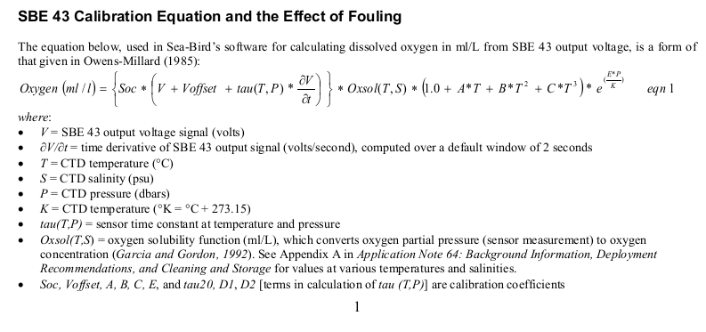

```{r setup, include=FALSE}
knitr::opts_chunk$set(echo = TRUE)

golem::document_and_reload()

library(dplyr)
library(lubridate)
library(plotly)
library(tidyr)
library(readr)
library(sear)
```

## Calibration data

### SBE19

```{r}
SBE19CalFile <- sear:::app_sys("cal", "sbe19", "7974.cal")

SBE19cal_data <- sear:::read_sbe19_cal()
```

### SBE43

```{r}
SBE43CalFile <- sear:::app_sys("cal", "sbe43", "3625.cal")

SBE43cal_data <- sear:::read_sbe43_cal()
```

### SBE18

```{r}
SBE18CalFile <- sear:::app_sys("cal", "sbe18", "1494.cal")

SBE18cal_data <- sear:::read_sbe18_cal()
```

## Calibrate data

SBE19 data consist of temperature pressure and conductivity which can be converted in Practical Salinity Unit (PSU). Additionally the SBE19 can record voltage send by optional instrument such as oxygen_concentration (SBE43) and pH (SBE18, case on the UQAR SeaDoo). To manage different instruments configurations it could be a solution to provide an instrument definition file to determine how the data should parsed.

```{r}
Station <- interval(ymd_hms("2022-07-05 12:23:13"), ymd_hms("2022-07-05 12:23:15"))

DataFile <- sear:::app_sys("extdata", "DATA_20220705_105732.txt")

MTELog <- sear:::read_mtelog(DataFile)

MTELog <- MTELog %>% filter(date_time %within% Station)

SBE19Data <- sear:::read_sbe19(MTELog)

Apla <- sear:::read_apla(MTELog) %>%
  summarise(
    lat = mean(lat_dd),
    lon = mean(lon_dd)
  )
```

### Salinity calibration

```{r}
# oxygen solubility in ml/l from Garcia and Gordon 1992
oxy_sol <- function(temperature, salinity_practical) {
  A0 <- 2.00907
  A1 <- 3.22014
  A2 <- 4.0501
  A3 <- 4.94457
  A4 <- -0.256847
  A5 <- 3.88767
  B0 <- -0.00624523
  B1 <- -0.00737614
  B2 <- -0.010341
  B3 <- -0.00817083
  C0 <- -0.000000488682

  Ts <- log((298.15 - temperature) / (273.15 + temperature))

  oxygen_solubility <- exp({
    A0 + (A1 * Ts) + (A2 * Ts)^2 + (A3 * Ts)^3 + (A4 * Ts)^4 + (A5 * Ts)^5 +
      salinity_practical * (B0 + (B1 * Ts) + (B2 * Ts)^2 + (B3 * Ts)^3) + (C0 * salinity_practical)^2
  })
}
```

EOS-80 (calculating PSU) have been replaced by TEOS-10 (calculating absolute salinity in g/kg), the package `gsw` implement the TEOS-10 algorithm.

The function `gsw::gsw_SP_from_C()` allow to compute practical salinity from conductivity.

```{r}
cal_sbe19 <- function(Data, lon, lat) {
  Data %>%
    mutate(
      salinity_practical = gsw::gsw_SP_from_C( # Salinity Practical in PSU
        c = conductivity * 10,
        t = temperature,
        p = pressure
      ),
      salinity_absolute = gsw::gsw_SA_from_SP( # Salinity Absolute in g/Kg
        salinity_practical = salinity_practical,
        p = pressure,
        long = lon,
        lat = lat
      ),
      conservative_temperature = gsw::gsw_CT_from_t( # Conservative temperature in deg c
        salinity_absolute = salinity_absolute,
        t = temperature,
        p = pressure
      ),
      oxygen_solubility = gsw::gsw_O2sol( # oxygen_concentration solubility in umol/kg
        salinity_absolute = salinity_absolute,
        conservative_temperature = conservative_temperature,
        p = pressure,
        longitude = lon,
        latitude = lat
      ),
      oxygen_solubility = oxy_sol( # oxygen solubility in ml/l from Garcia and Gordon 1992
        temperature = temperature,
        salinity_practical = salinity_practical
      )
    )
}

SBE19Data <- cal_sbe19(SBE19Data, Apla$lon, Apla$lat)
```

### oxygen_concentration concentration calibration

The calibration equation is given in the Application Note 64-2.


How to cumpute `tau(T, P)` sensor time constant at temperature and pressure ? Terms D1 and D2 are not present in the calibration file.

From "SBE43_ApplicationNote64_RevJun2013.pdf" the [tau(T,P) * δV/δt] derivative can be disabled.

the `Oxsol` parameter can be computed with `gsw::gsw_O2sol(salinity_absolute, conservative_temperature, p, longitude, latitude)`. SBE use oxygen_concentration saturation value after Garcia and Gordon (1992), should validate that I can use another method.
The absolute salinity (`salinity_absolute`) can be computed with `gsw_SA_from_SP(salinity_practical, p, long, lat)`.
The conservative temperature (`conservative_temperature`) can be computed with `gsw::gsw_CT_from_t`.

```{r}
cal_sbe43 <- function(Volt, Tcelsius, pressure, oxygen_solubility, cal_data) {
  soc <- cal_data$soc
  voffset <- cal_data$voffset
  a <- cal_data$a
  b <- cal_data$b
  c <- cal_data$c
  e <- cal_data$e

  Tkelvin <- Tcelsius + 273.15

  oxygen_concentration <- (soc * (Volt + voffset)) * oxygen_solubility * (1.0 + a * Tcelsius + b * Tcelsius^2 + c * Tcelsius^3) * exp(1)^(e * pressure / Tkelvin)
}

SBE19Data <- SBE19Data %>%
  mutate(
    oxygen_concentration = cal_sbe43( # oxygen_concentration in ml/l multiply by 1.42903 to get mg/l
      Volt = volt0,
      Tcelsius = temperature,
      pressure = pressure,
      oxygen_solubility = oxygen_solubility,
      cal_data = SBE43cal_data
    )
  )
```

### pH calibration

```{r}
cal_sbe18 <- function(Volt, Tcelsius, cal_data) {
  voffset <- cal_data$offset
  slope <- cal_data$slope

  Tkelvin <- Tcelsius + 273.15

  pH <- 7.0 + (Volt - voffset) / (slope * Tkelvin * 1.98416e-4)
}

SBE19Data <- SBE19Data %>%
  mutate(
    pH = cal_sbe18(
      Volt = Volt2,
      Tcelsius = temperature,
      cal_data = SBE18cal_data
    )
  ) %>%
  select(
    date_time,
    temperature,
    conductivity,
    pressure,
    salinity_practical,
    salinity_absolute,
    conservative_temperature,
    oxygen_solubility,
    oxygen_solubility,
    oxygen_concentration,
    pH
  ) %>%
  mutate(
    id = seq_along(rownames(SBE19Data)),
    qc = "1"
  )
```

## Plot Data

### L1b

```{r}
SBE19nest <- SBE19Data %>%
  select(!any_of(c("conductivity", "conservative_temperature", "oxygen_solubility"))) %>%
  pivot_longer(
    cols = any_of(c("temperature", "pressure", "salinity_practical", "salinity_absolute", "oxygen_solubility", "oxygen_concentration", "pH")),
    names_to = "parameter",
    values_to = "value"
  ) %>%
  group_by(parameter) %>%
  nest()


PlyFont <- list(family = "times New Roman", size = 18)
BlackSquare <- list(
  type = "rect",
  fillcolor = "transparent",
  line = list(width = 0.5),
  xref = "paper",
  yref = "paper",
  x0 = 0,
  x1 = 1,
  y0 = 0,
  y1 = 1
)

SBE19nest <- SBE19nest %>%
  mutate(
    Plot = purrr::map2(.x = data, .y = parameter, ~
      plot_ly(.x, text = ~id) %>%
        add_markers(x = ~date_time, y = ~value) %>%
        layout(
          shapes = BlackSquare,
          yaxis = list(title = list(text = .y))
        ))
  )


# format(SBE19nest[[2]][[1]]$date_time, "%Y-%m-%d %H:%M:%OS3")

subplot(SBE19nest$Plot, nrows = nrow(SBE19nest), shareX = TRUE, titleY = TRUE)
```


